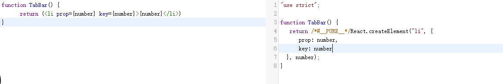
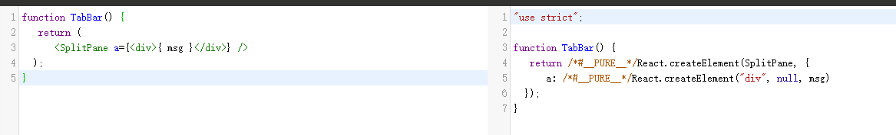
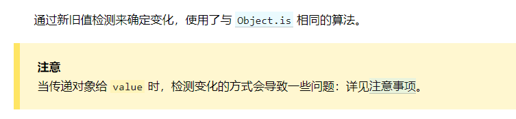

# 疑问
#### 1.如何设置scoped css

#### 2.重复render，会达到替换的效果，是根据哪些id，还是只是重新渲染一整颗树。
查看浏览器没有改动的dom，并没有重新替换，而是复用，可能是实例vnode树（自增id），

两颗整树对比，进行diff。

state的概念出来了

有key的概念，估计diff算法都是前后对比（或者加上最大子共序列）

#### 3.非要class组件才能使用state？（猜是hooks可以改变）

#### 4.hmr有问题，能复现，修改静态dom的时候并不会改变？

#### 5.```ReactDOM.render(jsx, DOM)```，直接修改```jsx```无法更新```hmr```有通知，但是前台页面没有拉取```js```。
> 在修改index.js 也就是react入口文件，不论怎么修改，也是一样前台页面不会拉取js。
> 并且，其他文件的hmr也失效了(ws有通知)，需要重新手动刷新页面。

https://codesandbox.io/s/holy-bush-b6dkh?file=/src/index.js

```codesandbox```行为，是```reload```页面。（```vue-cli/vite```中，修改```root```组件，行为一致）

#### 6.jsx如何让key成为dom参数


#### 7.调用```setState```内部是怎么运行的，性能如何，patch影响面积

# 知识点
#### 1.全程等于写render，jsx，{}自动寻找向上的变量名

#### 2.直接插入的内容 jsx会进行转义

#### 3.组件名称必须大写字母开头，```<Test/>```表示自定义组件，自定义组件寻找不到将error。
> HTML 标签里的元素名不区分大小写。不敏感
```javascript
function render() {
  return <div><test/></div>
}
```

#### 4.所有react组件都必须像存函数一样，不能改变自身参数。

#### 5.数据状态变动，使用state
```javascript
class C {
  constructor() {
   // ...
    this.state = {}  // 初始化
  }
  
  // 不支持fragment
  render() {
    return (
      <div>
        <h5>props:</h5>
        {this.state.date.toLocaleTimeString()}
        {this.props.date}
      </div>
    )
  }

}
```

#### 6.dom传入组件的参数，是真参数
和vue有不同的地方是，vue的props字段，可以自动过滤，哪些是dom参数，哪些是组件参数。

react中并不会配置成dom参数，统一当组件参数，如果需要设置组件最外层dom参数，需要手动配置。

#### 7.dom事件处理
> React 事件的命名采用小驼峰式（camelCase），而不是纯小写。
> 使用 JSX 语法时你需要传入一个函数作为事件处理函数，而不是一个字符串。
> 可以直接使用this.saySomething，自动寻找classComponent的原型链。
```javascript
function outSide() {
  console.log('hi im here')
}

class TestClassComponent {
  saySomething() {
    console.log('hi')
  }

  render() {
    return <div>
      <h5 onClick={outSide}>click me</h5>
      <div onClick={this.saySomething}>1</div>
    </div>
  }
}

TestClassComponent.prototype.saySomething = () => {
  console.log('change say something')
}
// 点击1，会发现被改写
// 点击click me 会发现class风格的component，原理和es5的实现class原理都是一样的。
```
关于点击事件，寻找的是原型链上的，所以没有```this```。也就是事件如果调用的方法，有```this```，那么```this```为上层（window）。

解决方法，提前```bind(this)```(好迷... 可以去查看jsx转换模板)。

#### 8.注释
```jsx harmony
  {/* <TestClassComponent date="123" dom-props="123" dom-int={123} /> */}
```

#### 9.可以使用componentWillUnmount删除因为hmr带来的重复状态

#### 10.render中可以返回null，隐藏组件，等同于移除组件，生命周期照常。

#### 11.jsx中可以直接使用```array: jsx[]```
因为转换为render，child的类型可以是数组。

#### 12.关于表单
一切都为```onChange```与```value```，多选的时候，可以设置multiple属性为true
```jsx harmony
<select multiple={true} value={['B', 'C']}>
```

#### 13.state提升、共享
改变成为props，把方法也调成props调用，再在父组件中setState，便会更新。（期待hooks）
不然这样太麻烦了... 如果多层修改... 无限props。

#### 14.关于组件的插槽
```jsx harmony
function T1(props) {
 return <div>{props.children}</div>
}

function T2() {
 return <T1>
          <div></div>
        </T1>
}
```

jsx只是把子tree转换成了props.children

还有更灵活的方式：
```jsx harmony
function SplitPane(props) {
  return (<div>{props.a}</div>)
}

function App() {
  const msg = 'test'
  return (<SplitPane a={<div>{ msg }</div>} />)
}
```



# babel/jsx:

```javascript
const element = (
  <h1 className="greeting">
    Hello, world!
  </h1>
);

// 转换：等于render
const element = React.createElement(
  'h1',
  {className: 'greeting'},
  'Hello, world!'
);
```

js类型的转换，只有NaN和0展示
```javascript
function render() {
           const number = [null, NaN, 0, "", undefined];
           return (
             <h1>
               {number.map((v, index) => {
                 return (
                   <h2 key={index}>
                     {index}: {v && ""}
                   </h2>
                 );
               })}
             </h1>
           );
           // 0:
           // 1: NaN
           // 2: 0
           // 3:
           // 4:
}
```

# 转换模板
jsx转换为render。方便查看代码本身。

https://www.babeljs.cn/


# 高级指引篇

## React.lazy
配合```Suspense```，实现loading化加载。用cra创建的项目，这项功能就是基于webpack的异步加载。

https://juejin.cn/post/6850418111599165448

被打包的文件会被分开。

命名导出：
https://react.docschina.org/docs/code-splitting.html#named-exports

## context
Context的主要使用场景在于很多不同层级的组件需要访问同样一些的数据。谨慎使用，复用组件十分烂，强绑定的传递，而且需要使用class（hooks牛逼？？）。

> Context 主要应用场景在于很多不同层级的组件需要访问同样一些的数据。
> Context 主要应用场景在于很多不同层级的组件需要访问同样一些的数据。
> Context 主要应用场景在于很多不同层级的组件需要访问同样一些的数据。
> Context 主要应用场景在于很多不同层级的组件需要访问同样一些的数据。
> Context 主要应用场景在于很多不同层级的组件需要访问同样一些的数据。

比vue的```provide```、```inject```还难用（Provide需要传递，双方都应用到）。

当 Provider 的 value 值发生变化时，它内部的所有消费组件都会重新渲染。Provider 及其内部 consumer 组件都不受制于 shouldComponentUpdate 函数，因此当 consumer 组件在其祖先组件退出更新的情况下也能更新。

这句话不太了解，shouldComponentUpdate不知道是什么，大体推测就是，value的改变强行更新consumer组件。

可以在任何生命周期中访问到他



学习到consumer 与 provider 的配合，其实也就和provide / inject一模一样了

## 高阶组件
组件是将props转换为UI，而高阶组件是将组件转换为另一个组件。

HOC其实就是把组件重复的东西收集起来，是一个概念（需要多花时间熟悉了），没有副作用
